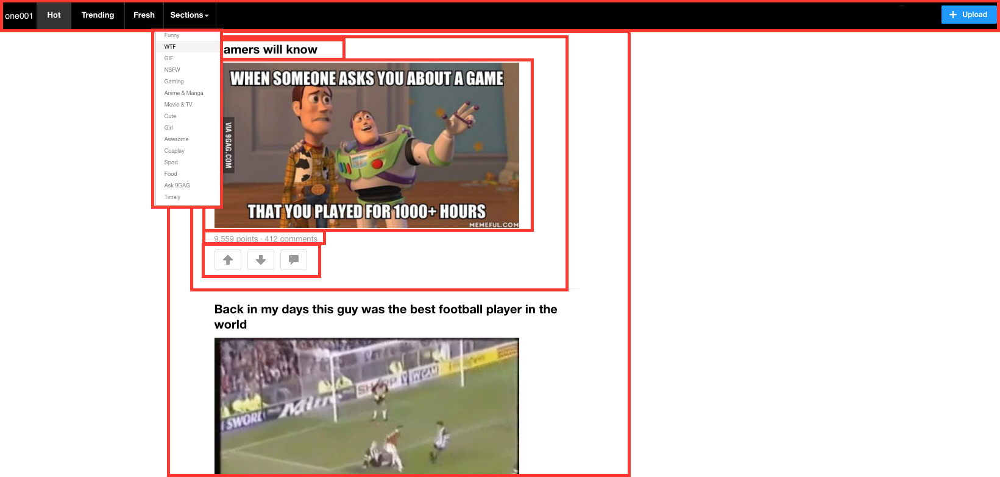
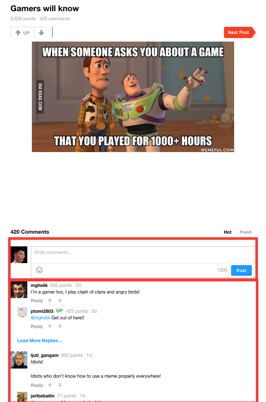

# one001gag

[one001gag live][heroku]

[heroku]: http://one001gag.herokuapp.com/

What is one001gag?
 - full-stack, `single-page` web application
 - inspired by 9gag
 - (but containing only tech/computer humor - `1001 is binary for 9!`)
 - `Ruby on Rails` backend
 - `PostgreSQL` database
 - `React.js with Redux` on the frontend.  

## Features & Implementation

### Auths

 - Root page listens to a `SessionStore` and renders content based on a call to `SessionStore.currentUser()`
 - API call to `SessionsController#get_user` keeps password and sensitive information out of the frontend

  ```

### Index (feed)


  - #index renders the feed which is a container of index-items that are loaded to the front-end.  The post data is stored in one table with the following fields:
    - `id`
    - `title`
    - `image_url`
    - `user_id`


!


### IndexItemDetail

  - #show renders a single post with comments nested.  Comments table contains the following fields:
    - `content`
    - `user_id`
    - 'commentable_id' (comment or )

!

### New Comment
  - new Comment form listed below the post #show page


### UpVotes / DownVotes

  - `Upvotes/Downvotes` on (posts or comments) are only shown as an aggregate count and stored in a join table:
    - `user_id` (only one vote per user per item!)
    - `post_id` / `comment_id` (polymorphic)
