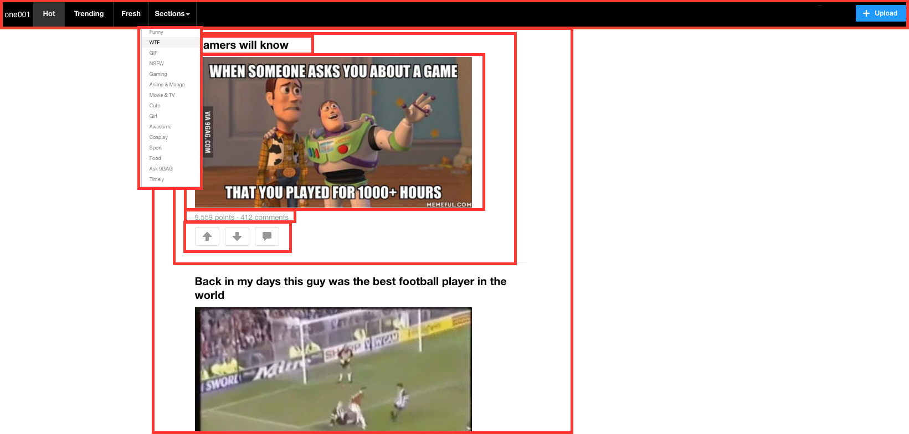

# one001gag

[one001gag live][heroku]

[heroku]: http://www.9gag.com

What is one001gag?
 - full-stack, `single-page` web application
 - inspired by 9gag
 - (but containing only tech/computer humor - `1001 is binary for 9!`)
 - `Ruby on Rails` backend
 - `PostgreSQL` database
 - `React.js with Redux` on the frontend.  

## Features & Implementation

### Auths

 - Root page listens to a `SessionStore` and renders content based on a call to `SessionStore.currentUser()`
 - API call to `SessionsController#get_user` keeps password and sensitive information out of the frontend

```ruby  
#TO BE EDITED:

class Api::SessionsController < ApplicationController
    def get_user
      if current_user
        render :current_user
      else
        render json: errors.full_messages
      end
    end
 end
  ```

### Index (feed)

to be edited:

  - #index renders the feed which is a container of post-index-items that are loaded to the front-end 10 items at a time.  The post data is stored in one table with the following fields:
    - `title`
    - `image_id`
    - `URL`
    - `NSFW` (boolean)
    - `user_id`


    `Index` render method:


    ```javascript   to be edited:
    render: function () {
      return ({this.state.notebooks.map(function (notebook) {
        return <CondensedNotebook notebook={notebook} />
      }
      <ExpandedNotebook notebook={this.state.selectedNotebook} />)
    }

!


### Posts

  - #show renders a single post with comments nested.  Comments table contains the following fields:
    - `content`
    - `user_id`

!

### New Comment
  - new Comment form listed below the post #show page


### UpVotes / DownVotes

  - `Upvotes/Downvotes` on (posts or comments) are only shown as an aggregate count and stored in a join table:
    - `user_id` (only one vote per user per item!)
    - `post_id` / `comment_id` (polymorphic)


### Tags

  - Stored in db as tags table with only one field:
    - `name`

### Taggings
  - A join table with fields:
    - `post_id`
    - `user_id`

```

## Future Directions for the Project

In addition to the features already implemented, I plan to continue work on this project.  The next steps for one001gag are outlined below.


TBD
